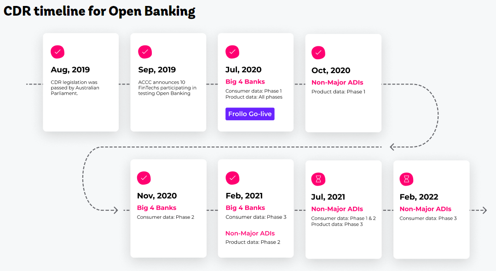

# Frollo: an exploratory case study

## Overview and Origin

###  Frollo
Frollo are at the forefront of Australia's move to adopting the Open Banking set of frameworks and enabling local FinTechs to do the same.  Frollo's ambitions aren't limitted to Australia as they partner with FinTechs and legacy players globally, empowering them to effectively adopt their respective Open Banking standards [[1][1]].

Frollo is a strange little name, made up of two words, "Front" and "Follow" and hints at their purpose-driven approach, which is to "help people feel good about money" [[2][2]].

### When was the company incorporated?
### Who are the founders of the company?
### How did the idea for the company (or project) come about?
Frollo's humble beginnings began in 2015 by its founder and current CEO, Gareth Gumbley, who similarly, grew up with humble surroundings which required having a side-hustle or two in earning his living and ensure his dreams and goals were kept on track.

With Gareth's earlier career in Finance and Technology, and desire to help others, he started Frollo with the purpose of seeing Australians correct their relationship with money, specifically to help improve peoples lives through increased financial wellbeing and thereby reducing related stress.

The intial offerings from Frollo were a free mobile app for the man-on-the-street, thus kicking off their B2C product.  Furthering their mission, they started on their B2B offerings by building a platform which enabled other organisations do the same and further their mission of increasing people's financial wellbeing.  This platform became the precursor to the Open Banking platform it is today, enabling them to participate in the Australian Competition & Consumer Commission's (ACCC) Open Banking pilot to become the first Open Banking ADR (accredited data recipient).

### How is the company funded? How much funding have they received?
How has Frollo been able to achieve their current position in Australia's Open Banking domain?  Well, Frollo's funding history is fairly simple; it does not span years and multiple rounds of funding, and has a similarly scarce amount of publicly available information on the amounts involved.  This is remarkable, given where they find themselves placed in their domain.

A short and sweet timeline of their funding history: -

| Year  | Funding Description |
| ----- |:------------------- |
| 2015  | In true Frollo style, the company was initally funded by friends and family |
| 2018  | Frollo recieved a grant by Metlife (Sept. 2018 [[3][3]]) to expand and improve their free B2C App |
| 2019  | Frollo acquired Hip Money (Sept. 2019 [[4][4]]) a small Brisbane-based FinTech primarly for their AI enabled App which focused on consumer saving and debt elimination; remarkably and simmilarly aligned to their primary goal |
| 2020  | Frollo was acquired by NextGen.Net (July 2020 [[5][5]]) for an undisclosed amount.  NextGen.Net acquired Frollo, seeking their Open Banking solutions which closely align to their own Mortage and Lending data ecosystem |

## Business Activities:

### What specific financial problem is the company or project trying to solve?

Frollo seems to have been started at just the right time for the domain they find themselves in and the problems they look to solve.  Australia's Financial landscape, along with its banks and other institutions have not had the easiest of times recently.  The advent of the Banking Royal Commission, a.k.a The Royal Commission into Misconduct in the Banking, Superannuation and Financial Services Industry, brought to light the ultimate power finanical insitutions have over their customers, smaller institutions reliant on them, and *some* judicial bodies [[6][6]].

One of the fortuitous events that took place at much the same time as Australia's Banking Royal Commission was ACCC's Productivity Commission Inquiry into Competition in the Australian Financial System [[7][7]] and its main recommendations were for the protection of banking customer data and ensuring the easy transition of a customer between financial institutions.  This had, to a degree, already had the wheels of motion turning in Europe and the United Kingdom with the UK in 2016 adopting parts of the Payment Services Directive (PSD2) on the back of their own enquiry into the competitevness of their financial industry and institutions.  The UK's Open Banking directives were a direct result of a ruling by the Competition and Markets Authority (CMA) to ***specifically allow licenced Fintech statups access to their transaction (and other) data*** [[8][8]].

The rest is history.

*Enter Frollo!! And the power of Open Banking ...*

The average Joe wants to simply go about his business, be treated fairly and not have to worry about whether the institutions he has entrusted his finances to, are on his side or completely take advantage of him.  Knowing the findings of the various inquiries into financial institutions, the latter is unfortunately true.

### Who is the company's intended customer?  Is there any information about the market size of this set of customers?

Frollo, with both its B2C/B2B white-label financial wellbeing and Personal Financial Management (PFM) consumer app along with its B2B financial data integration SaaS platform, is well placed to resolve the problems still so prevalent in the industry.  Its target market is almost anyone who has financial data and a smartphone, wanting to make more healthy financial decisions or any licenced financial institution, legacy or Fintech startup, do the same fir==or their customers and using their platform rapidly scale their entrance into the modern banking fray, capitalising on the gold mine that is consumer data.

### What solution does this company offer that their competitors do not or cannot offer? (What is the unfair advantage they utilize?)

Of course, potential entrants could build their own platforms, but they would need to become registered participants of the Open Banking ecosystem, administer their own data-consent and insight systems to remain competetive, nevermind become a competitor in the space.  This openness, transparency and control is what consumers have come to expect and now demand.

Frollo has been working with the ACCC from the start of its Open Banking trials and through that time has built up a number of assets that set it apart from any number of players in the Open Banking domain globally, nevermind Australia, where it is the leader.

### Which technologies are they currently using, and how are they implementing them? (This may take a little bit of sleuthing–– you may want to search the company’s engineering blog or use sites like Stackshare to find this information.)

Frollo has built up its open banking solutions ecosystem, encompasing an AI engine, any number of APIs, partner integrations and powerful home grown components.  They are inherently cloud native, using AWS (Amazon Web Services) as their primary Cloud Vendor and making use of AWS's API Gateway, their Shield, SageMaker and WAF (Web Application Firewall) [[9][9]].  These form the SaaS platform and enable access and use of the gold mine that is consumer transactional data.  The consumer app, as previously described, as important as it is in the way in which the information is presented to the user, is but meaningless and empty pixels without the power the platform provides it.

Frollo's Open Banking solutions [[10][10]] and use of key technologies: -

| Frollo Solution | Technology | Description |
| --------------- | :--------- | :---------- |
| CDR Gateway | APIs, Big Data, SDKs, Cloud, AI | The platform! A powerful solution for consent management and CDR data collection and transaction enrichment |
| Product Ref. Data Portal        | APIs, Cloud, SDKs | Simple and future-proof ways to reference and publish compliant Open Banking product data APIs |
| Statement of Financial Position | APIs, Big Data, Cloud, AI | Real-time and streamlined credit decision using CDR data and AI |
| Data Enrichment APIs            | APIs, Cloud, Big Data, AI | Unstructured CDR data turned into meaningful insights using AI.  Categorisation-as-a-Service; Multi data sources; single API; always improving |
| Data Holder Testing | APIs, SDKs, Big Data, Cloud, AI | Open Banking Compliance preparation; "Data Holder" testing, saving time and money; creating confidence with high standards |

The key differentiators of Frollo's solutions is data enrichment, making extensive use of Machine Learning with its data.  Frollo run most workloads on AWS, having chosen the platform for its data and analytics capability, built-in security controls, and Machine Learning tools.

## Landscape:

### What domain of the financial industry is the company in?

### What have been the major trends and innovations of this domain over the last 5-10 years?

### What are the other major companies in this domain?

As a fairly young FinTech, Frollo currently operates within the Open Banking landscape.  The landscape is driven by the advent of Open Banking directives which have turned the tables on the ownership of consumer data in favour of consumers, enabling its primary tenet - Consumer Data Rights; the right that a consumer has over their own data and their choice as to who can access their data, and how it used.

Open Banking and its implication for data ownwership does not stop at financial data for financial institutions, but is extending to other industries, including Telcos and Energy.  A wealth of data, slowly opening up to those who are ready for it.

## Results

### What has been the business impact of this company so far?

Frollo primarily sees itself as an enabler of disruption and is willing to partner with those startups or even encumbents that are willing to become more nimble and focus on the future of banking, i.e. its open and consumer-focussed future.  With its early adoption of Open Banking standards, open and consumer-focused approach, their platform has grown to being dominant with the processing of 95% of all Open Banking related activity!

Their approach to Open Banking is paying off with a number of high-profile announcements in recent months [[11][11]]: -
- May 2021
  - Frollo and EML partner in providing Australia’s first  Open Banking Payments Platform
- April 2021
  - ANZ partners with Frollo for access to Open Banking data
  - Canstar partners with Frollo to launch PFM app
  - Virgin Money Australia launches new digital bank and partners with Frollo on their PFM platform

The effects of what Open Banking has been able to accomplish is evident in the partnership between Volt Bank and Frollo, enabling Volt earlier in their history (while not yet in possession of a full banking license) to quickly gain consumer trust and help form their own offerings.  The benefits of this open approach to banking is most evident in the recent announcement of the partnership between Volt and RailsBank Asia Pacific to provide Banking-as-a-Service, enabling the bank to enter the Australian market [[12][12]].  Volt would not have been able to partner with Railsbank would it not have been for its access to Frollo's platform.

### What are some of the core metrics that companies in this domain use to measure success? How is your company performing, based on these metrics?

### How is your company performing relative to competitors in the same domain?

At this point, it would not be innaccurate to make the determination, that Frollo is the leader of this domain in Australia, and while it remains an enabler of other disruptors, startups and forward thinking FinTechs, it will remain on top as it has already accomplished the creation of a robust platform already being used by a number customers with a bright future.

Larger (can be read as older) financial organisations are doing a number of things within the Open Banking landscape, but seem more interested in grabbing a slice of the product pie, e.g. loans, cards, insurance, etc. by fleshing out platforms within their own legacy ecosystems, and not focussing on the biggest benefit of Open Banking, namely the avalanche of data that it opens up [[13][13]].  One could argue that these encumbents already have all the data they need internally and the rush to build out BaaS platforms and rent out their licences is something they could focus on, but they forget, the data isn't theirs; ignore the owners of the data and they will leave and take their data with them.

## Recommendations

### If you were to advise the company, what products or services would you suggest they offer? (This could be something that a competitor offers, or use your imagination!)

### Why do you think that offering this product or service would benefit the company?

### What technologies would this additional product or service utilize?

### Why are these technologies appropriate for your solution?

It is difficult to know what strategies Frollo has up its sleeve, however assuming I had the ear of the CEO, I'd put a number of recommendations to him and his Team.
- Frollo should not wait for the Open Banking timeline to roll out, but begin preparing for what may not be obvious: -
  - With consumer consent (their own Frollo consumer app users), start to seek out financial institutions, not part of the first tranche of Open Banking participants (legacy big 5), i.e. smaller or newer entrants into the Fintech space, new neo banks, payments or wealth management startups and incentivise them to use their platform.  This will expand the disruption that their platform enables, but similarly gain newer forms of data in potentially a younger demographic and unlock differing behaviors from encumbent/ordinary CDR data.
  - Start to build out APIs in anticipation of the onboarding of Telco and Energy into the Open Banking / Open Data landscape.  Capitalising on these new sources of CDR would open up the potential for Frollo to expand their influence within Big Data and AI.  Not to mention a whole new source of disruption.
- Frollo's platform, as powerful and capable as it is, is currently one which is centralised.  I'd motivate for them to start to think about decentralising.  This is both an emerging macro trend, but more importantly, is about the rights of the consumers whose data their platform exists to serve.  They could make use of differing big data and cloud technologies to shard their platform's capabilities.  Thinking about using Blockchain protocols (Etherium is continually improving, with the introduction of sharding emminent) to enable decentralisation.  As Frollo grows, and takes on more data, the temptation will be to keep growing and scale the current platform.
- Frollos is already expanding into payments (as is evident with their latest partnership with EML).  They could expand upon their soon-to-be new foray into the blockchain's capabilities and capitalise on the openness that it provides, in line with what consumers will continue to want.

---
## Addendum

### References / Sources

\[-] Wired, Open Banking Explained: <https://www.wired.co.uk/article/open-banking-cma-psd2-explained>

\[1] Frollo PRD customers: <https://frollo.com.au/enterprise/prd/>

[1]: [<https://frollo.com.au/enterprise/prd/>] "Frollo PRD customers"

\[2] About Frollo: <https://frollo.com.au/about-us/>

[2]: [<https://frollo.com.au/about-us/>] "About Frollo"

\[3] New York based FinTech: <https://www.crunchbase.com/funding_round/frollo-grant--b3e01401>

[3]: [<https://www.crunchbase.com/funding_round/frollo-grant--b3e01401>] "New York based FinTech"

\[4] Hip Money, source - crunchbase: <https://australianfintech.com.au/leading-fintech-frollo-acquires-ai-powered-savings-provider-hip-money-to-expand-its-financial-wellbeing-platform/>

[4]: [<https://australianfintech.com.au/leading-fintech-frollo-acquires-ai-powered-savings-provider-hip-money-to-expand-its-financial-wellbeing-platform/>] "Sourced via crunchbase.com"

\[5] NextGen, source - crunchbase: <https://nextgen.net/#!/news/20200707-2>

[5]: [<https://nextgen.net/#!/news/20200707-2>] "Sourced via crunchbase.com"

\[6] Wikipedia: Banking Royal Commission: <https://en.wikipedia.org/wiki/Royal_Commission_into_Misconduct_in_the_Banking,_Superannuation_and_Financial_Services_Industry>

[6]: [<https://en.wikipedia.org/wiki/Royal_Commission_into_Misconduct_in_the_Banking,_Superannuation_and_Financial_Services_Industry>] "Wikipedia: Banking Royal Commission"

\[7] ACCC: PC Inquiry: <https://www.accc.gov.au/system/files/ACCC%20submission%20to%20Productivity%20Commission%20Inquiry%20into%20Competition%20in%20the%20Australian%20Financial%20System.pdf>

[7]: [<https://www.accc.gov.au/system/files/ACCC%20submission%20to%20Productivity%20Commission%20Inquiry%20into%20Competition%20in%20the%20Australian%20Financial%20System.pdf>] "ACCC: PC Inquiry"

\[8] Wikipedia: Open Banking (UK): <https://en.wikipedia.org/wiki/Open_banking>

[8]: [<https://en.wikipedia.org/wiki/Open_banking>] "Wikipedia: Open Banking (UK)"

\[9] AWS: Frollo Case Study:<https://aws.amazon.com/solutions/case-studies/frollo/>

[9]: [<https://aws.amazon.com/solutions/case-studies/frollo/>] "AWS: Frollo Case Study"

\[10] Frollo - Open Banking Solutions: <https://frollo.com.au/open-banking/>

[10]: [<https://frollo.com.au/open-banking/>] "Frollo - Open Banking Solutions"

\[11] Frollo and ANZ partner: <https://frollo.com.au/blog/anz-partners-with-frollo-for-access-to-open-banking-data/>

[11]: [<https://frollo.com.au/blog/anz-partners-with-frollo-for-access-to-open-banking-data/>] "Frollo and ANZ partner"

\[12] Railsbank and Volt partner: <https://www.brokernews.com.au/news/breaking-news/global-fintech-inks-deal-with-aussie-neobank-276011.aspx>

[12]: [<https://www.brokernews.com.au/news/breaking-news/global-fintech-inks-deal-with-aussie-neobank-276011.aspx>] "Railsbank and Volt partner"

\[13] Westpac chases BaaS: <https://www.afr.com/companies/financial-services/westpac-expands-banking-as-a-service-diverging-from-cba-strategy-20210326-p57eau>

[13]: [<https://www.afr.com/companies/financial-services/westpac-expands-banking-as-a-service-diverging-from-cba-strategy-20210326-p57eau>] "Westpac chases BaaS"

---
\- Author: Andrew Aylward  
\- Date:   16.05.2021